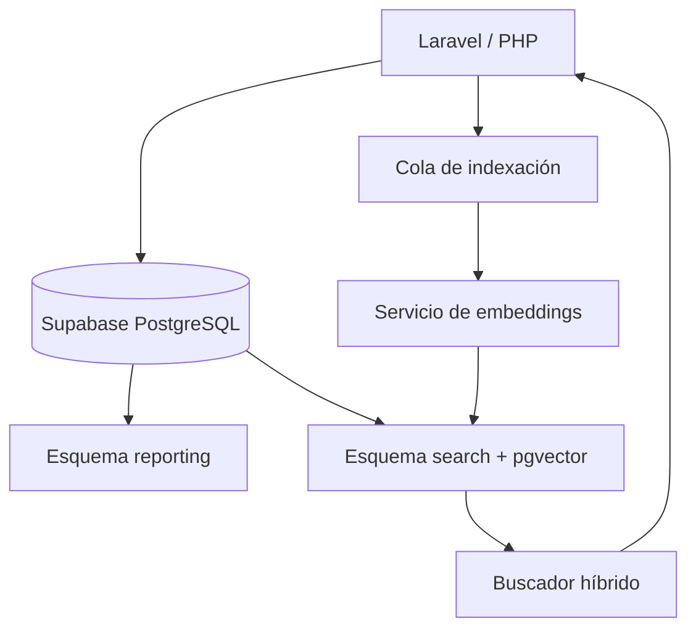

# Informe de viabilidad y plan de migración

**Sistema:** Administración de perfiles de afiliados — Cámara Petrolera de Venezuela  
**Fuente analizada:** `campetapp_campet202212 (2).sql` (MySQL 8)  
**Fecha:** 10 de agosto de 2026  
**Decisión recomendada:** Migrar a PostgreSQL gestionado en Supabase, conservando Laravel como backend. Usar `pgvector` dentro de la misma instancia, no una segunda base vectorial.

## 1. Resumen ejecutivo

La migración es **viable** y el tamaño actual hace que sea un buen momento para ejecutarla: el volcado ocupa aproximadamente 1,6 MB y contiene 38 tablas físicas, 15 vistas de informes y 26 relaciones de clave foránea. La entidad central es `empresas` (el volcado registra una secuencia hasta 535); los catálogos y datos de perfil se relacionan principalmente con ella.

El riesgo no está en transferir los datos, sino en preservar el comportamiento de los reportes. Las 15 vistas MySQL usan agregación y extracción de JSON: el volcado contiene 15 usos de `JSON_TABLE`, 41 de `JSON_EXTRACT`, 34 de `JSON_UNQUOTE` y 18 de `GROUP_CONCAT`. Estas expresiones no son portables literalmente a PostgreSQL.

No se recomienda reemplazar Laravel por el cliente REST de Supabase. Laravel puede conectarse directamente a PostgreSQL mediante PDO/Eloquent y seguir controlando autenticación, autorización, validaciones, colas y presentación. Supabase aporta PostgreSQL administrado, backups, observabilidad, `pgvector` y, si se desea después, Auth/Storage/Realtime.

## 2. Inventario y hallazgos del esquema actual

| Elemento | Hallazgo | Implicación |
|---|---:|---|
| Tablas físicas | 38 | Migración manejable; crear migraciones PostgreSQL versionadas. |
| Vistas de informes | 15 | Reescritura y pruebas de equivalencia obligatorias. |
| Claves foráneas | 26 | El modelo es relacional y se preserva bien en PostgreSQL. |
| Datos JSON | `assets`, `experiences`, `presences`, `management`, `empresas.customers_country` | Migrar a `jsonb`; normalizar gradualmente los bloques que deben filtrarse o reportarse. |
| Autenticación y roles | `users`, roles/permisos tipo Spatie, tokens y password resets | Mantener inicialmente Laravel Auth/Spatie para reducir riesgo. |
| Tablas puente | `empresa_sector_service`, `empresa_user`, `contact_empresa`, `chamber_empresa` | Añadir claves primarias compuestas o `unique` donde hoy solo existen índices. |
| Objeto incompleto | `category_entity` solo tiene `id` | No debe migrarse tal cual; sustituirlo por el modelo de categorización propuesto. |

### Aspectos a corregir durante la migración

1. **Enteros sin signo.** PostgreSQL no tiene `UNSIGNED`; los `bigint unsigned` actuales caben en `bigint` por los identificadores observados. Preservar los IDs para no romper relaciones ni rutas Laravel.
2. **JSON como `longtext`.** Convertir a `jsonb` después de validar que cada valor sea JSON válido. PostgreSQL podrá indexarlo con GIN, pero no debe usarse como sustituto permanente de tablas relacionales para filtros frecuentes.
3. **Vistas MySQL.** Sustituir `GROUP_CONCAT` por `string_agg`, `JSON_TABLE` por `jsonb_array_elements`, `JSON_EXTRACT/JSON_UNQUOTE` por operadores `->` y `->>`, y `IF()` por `CASE` o `FILTER`.
4. **Nombres con mayúsculas.** Las vistas como `ChatView` y `MatrizDatos` deben crearse entre comillas o, preferiblemente, renombrarse a `chat_view` y `matriz_datos` con una capa de compatibilidad temporal para Laravel.
5. **Definers MySQL.** Los `SQL SECURITY DEFINER` y usuarios incluidos en el dump no se transportan. Las vistas de Supabase deben ser `security_invoker` si son accesibles desde esquemas expuestos, o quedar en un esquema privado de reporting.

## 3. Arquitectura recomendada



### Esquemas y responsabilidades

| Esquema | Contenido | Exposición |
|---|---|---|
| `public` | Tablas operativas migradas y nuevo modelo de categorías | Solo Laravel mediante conexión de servidor al inicio. |
| `reporting` | Vistas o vistas materializadas para informes | Privado; acceso por Laravel. |
| `search` | Documentos de índice, embeddings, funciones de búsqueda y colas | Privado; sin acceso directo desde navegador. |

La base vectorial es una **capacidad**, no una base independiente: `pgvector` guarda y busca embeddings en PostgreSQL. Mantener los vectores junto a los datos evita ETL duplicado y permite filtrar resultados por estado del afiliado, categoría, región o cámara dentro de una misma consulta. Supabase documenta el uso de `pgvector` para almacenar embeddings y búsqueda de similitud; también advierte que los filtros junto a índices ANN requieren diseño cuidadoso para recuperar suficientes candidatos. [Documentación de pgvector](https://supabase.com/docs/guides/database/extensions/pgvector)

## 4. Nuevo módulo: SupplHi Standard Categorization

Antes de cargar la taxonomía hay que confirmar la licencia, versión, idioma y derecho de redistribución de SupplHi. No se debe copiar ni publicar una taxonomía propietaria hasta validar esas condiciones con el proveedor.

Modelo propuesto, independiente de la forma exacta de la taxonomía:

| Tabla | Finalidad |
|---|---|
| `supplier_categories` | Nodo de la taxonomía: código, nombre, descripción, nivel, nodo padre, versión, vigencia. |
| `supplier_category_aliases` | Sinónimos ES/EN y términos venezolanos equivalentes. |
| `empresa_supplier_categories` | Relación empresa–categoría, origen (`self_declared`, `suggested`, `validated`), confianza, aprobador y fechas. |
| `empresa_catalog_items` | Oferta concreta: nombre, descripción, marca/modelo opcional, disponibilidad, alcance geográfico y estado. |
| `category_mapping_audit` | Historial de asignaciones, cambios y evidencia. |

Reglas funcionales:

- La empresa puede proponer categorías, pero una categoría sugerida por IA no queda publicada sin revisión humana.
- Debe existir una categoría de taxonomía, versión y estado por cada asignación.
- Los servicios actuales existentes (`services` y `empresa_sector_service`) se conservan y se mapean progresivamente, sin borrar la clasificación de la Cámara.
- El catálogo detallado debe vivir en `empresa_catalog_items`, no únicamente en un JSON, porque será el objeto que el buscador encontrará, puntuará y auditará.

## 5. Índice y buscador: diseño correcto

No conviene ejecutar un crawler que recorra la base completa en cada consulta. El patrón correcto es un **indexador incremental**.

1. Una modificación de empresa, servicio, categoría, inventario o experiencia marca la empresa como pendiente en `search.index_queue`.
2. Un Laravel Job toma la empresa, genera un documento canónico con datos publicados y calcula un hash del contenido.
3. Solo si el hash cambió, el job genera el embedding, actualiza `search.company_documents` y registra el estado.
4. La búsqueda combina texto, taxonomía/filtros y similitud semántica; devuelve empresas y evidencia de por qué coincidieron.
5. Un proceso nocturno de reconciliación reindexa solo pendientes y detecta inconsistencias, no reemplaza el flujo incremental.

### Documento indexable por empresa

Incluir: nombre y RIF, sectores y servicios actuales, categorías SupplHi validadas, productos/servicios ofertados, descripción, capacidad relevante, ubicaciones, experiencia y palabras clave aprobadas. Excluir: contraseña, tokens, emails/telefonía de contactos no autorizados, datos internos, datos financieros sensibles y campos sin publicar.

### Búsqueda híbrida

La calidad no debe depender solo del vector. Combinar:

- Filtro estructurado obligatorio: afiliado activo, categoría, ubicación, estado de publicación.
- Búsqueda léxica española con `tsvector` y un índice GIN para códigos, nombres exactos, siglas y términos técnicos.
- Similaridad vectorial para equivalencias semánticas y consultas en lenguaje natural.
- Reranking: coincidencia de categoría validada y de nombre de ítem por encima de texto genérico.
- Respuesta trazable: empresa, categoría/ítem coincidente, fragmento de evidencia, puntuación y fecha de indexación.

Una tabla de índice suficiente para la primera versión sería:

```sql
create table search.company_documents (
  empresa_id bigint primary key references public.empresas(id) on delete cascade,
  content text not null,
  content_hash text not null,
  search_vector tsvector generated always as
    (to_tsvector('spanish', coalesce(content, ''))) stored,
  embedding extensions.vector(<dimension_del_modelo>) not null,
  metadata jsonb not null default '{}'::jsonb,
  indexed_at timestamptz not null default now()
);

create index company_documents_fts_idx
  on search.company_documents using gin (search_vector);
```

La dimensión del vector se define cuando se elija el modelo de embeddings; no debe fijarse antes. Para el piloto, HNSW es una opción razonable si la extensión y el tamaño lo permiten; se validará con consultas reales y métricas de relevancia.

## 6. Plan de migración por fases

| Fase | Actividades | Criterio de salida |
|---|---|---|
| 0. Descubrimiento (1 semana) | Inventario de repositorio Laravel, versiones, paquetes, consultas SQL, jobs, rutas, políticas, datos inválidos y licencia SupplHi. | Matriz de dependencias y criterios de aceptación aprobados. |
| 1. Diseño destino (1 semana) | Definir DDL PostgreSQL, esquemas, mappings de tipos, estrategia de usuarios, RLS y modelo de categorías. | Migraciones revisadas y entorno no productivo listo. |
| 2. Conversión y carga piloto (1 semana) | Exportar MySQL consistente, transformar CSV/JSON, cargar catálogos y tablas, conservar IDs y reiniciar secuencias. | Recuentos, checksums y FK sin errores. |
| 3. Reporting (1–2 semanas) | Reescribir 15 vistas, preferentemente en `reporting`; comparar fila a fila los resultados críticos. | Paridad aprobada para cada informe. |
| 4. Adaptación Laravel (1–2 semanas) | Configurar `pgsql`, revisar Eloquent/Query Builder/SQL crudo, pruebas de login, edición de perfil, permisos, informes, jobs y APIs. | Suite funcional y de regresión verde. |
| 5. Categorías y búsqueda (2 semanas) | Cargar taxonomía autorizada, construir interfaz, indexador, embeddings, búsqueda híbrida, trazabilidad y evaluación. | Conjunto de consultas de negocio con relevancia aceptada. |
| 6. Cutover (2–5 días) | Ensayo de migración, ventana de solo lectura, delta final, verificaciones, cambio de conexión y plan de reversión. | Producción estable y monitoreada. |

Estimación inicial: **6–9 semanas** con un desarrollador Laravel y un responsable de datos/QA, una vez disponible el repositorio y la taxonomía. No incluye la obtención de licencia ni la limpieza manual de contenido de empresas.

## 7. Complejidad de modificar Laravel

**Complejidad total: media-alta, pero controlable.** Cambiar la conexión básica es simple; la migración completa exige revisión porque las vistas y cualquier SQL MySQL específico son parte de la aplicación.

| Área Laravel | Complejidad | Trabajo requerido |
|---|---|---|
| Eloquent estándar, migrations y relaciones | Baja | Cambiar driver a `pgsql`, revisar tipos, seeders y secuencias. |
| Consultas con Query Builder | Baja-media | Validar paginación, booleanos, fechas, `pluck`, JSON y ordenaciones. |
| SQL crudo / DB::select | Alta | Reescribir sintaxis MySQL, funciones JSON, `IF`, agregaciones y quoting. |
| Vistas y exportes de reportes | Alta | Migrar/revalidar las 15 vistas y sus consumidores. |
| Autenticación actual Laravel/Spatie | Media | Mantener inicialmente tablas/guard; no mezclar con Supabase Auth en el primer corte. |
| Colas y tareas programadas | Baja-media | Mantener jobs; añadir cola de indexación e idempotencia. |
| Acceso directo del navegador a Supabase | Alta y evitable | Posponer. Si se habilita, diseñar RLS y políticas por empresa/usuario. |

La estrategia de menor riesgo es un corte en dos etapas:

1. **Etapa A:** MySQL → PostgreSQL/Supabase sin cambiar el contrato funcional de Laravel ni el login.
2. **Etapa B:** módulo SupplHi y búsqueda. Solo después evaluar Supabase Auth, REST, Realtime o acceso desde el navegador.

## 8. Seguridad y gobierno de datos

- Mantener inicialmente todas las conexiones desde Laravel en backend; jamás exponer la contraseña de PostgreSQL ni `service_role` en JavaScript.
- Si se expone cualquier tabla a la API de Supabase, habilitar RLS y crear políticas basadas en la pertenencia comprobada entre usuario y empresa. RLS es obligatorio en tablas de esquemas expuestos y sin políticas bloquea el acceso mediante la API. [Guía de RLS de Supabase](https://supabase.com/docs/guides/database/postgres/row-level-security)
- Mantener `reporting` y `search` fuera de esquemas expuestos; las vistas no deben evitar RLS por accidente.
- Definir qué datos del perfil son públicos, para afiliados, para administradores de Cámara o internos antes de indexarlos.
- Cifrar conexiones, habilitar backups/PITR conforme al plan contratado, registrar cambios de clasificación e incluir retención de embeddings al borrar o despublicar una empresa.

## 9. Validaciones obligatorias antes del corte

1. Recuento de registros por tabla y comparación de IDs huérfanos.
2. Validación de todos los JSON antes de conversión a `jsonb`.
3. Comparación de los 15 reportes con una muestra representativa y los totales de producción.
4. Pruebas de creación, edición, eliminación, permisos y recuperación de contraseña.
5. Pruebas de búsqueda: mínimo 30 consultas reales, con resultados esperados definidos por la Cámara.
6. Prueba de rollback ensayada: Laravel puede volver temporalmente a MySQL si el corte falla.

## 10. Decisión y siguientes pasos

La migración es recomendable si el objetivo es añadir clasificación estandarizada y búsqueda avanzada. El modelo actual puede soportar un piloto, pero extenderlo solo con JSON y vistas MySQL incrementaría la deuda técnica.

Los siguientes insumos necesarios para pasar del plan a una implementación exacta son:

1. Repositorio Laravel completo y archivo `.env` sin secretos (para identificar SQL crudo, versión de Laravel y paquetes).
2. Acceso de lectura a MySQL o un dump actualizado consistente.
3. Archivo/documentación de la taxonomía SupplHi y sus condiciones de licencia.
4. Reglas del cliente para afiliado activo, visibilidad de datos y quién aprueba categorías.
5. 30–50 búsquedas reales con el resultado empresarial esperado, para medir precisión y ajustar el buscador.

