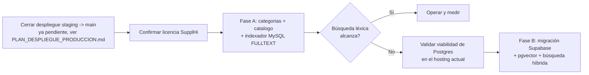

# Informe v2 — Categorización SupplHi, buscador de afiliados y migración de base de datos

**Sistema:** Administración de perfiles de afiliados — Cámara Petrolera de Venezuela
**Repositorio analizado:** `PerfilAfiliadosCPV` (rama `staging`), Laravel 9 / PHP 8 / Filament 2, MySQL, hosting compartido cPanel.
**Fecha:** 10 de agosto de 2026
**Reemplaza a:** [`informe_migracion_mysql_supabase_camara_petrolera.md`](informe_migracion_mysql_supabase_camara_petrolera.md) (v1, 10 de agosto de 2026), que se conserva como referencia histórica del análisis original del volcado MySQL.

## Qué cambia respecto a v1

v1 se escribió a partir del volcado SQL (`campetapp_campet202212 (2).sql`) sin inspeccionar el repositorio actual. Esta versión sí lo hizo, y eso cambia la recomendación en dos puntos importantes:

1. **El hosting es cPanel compartido** (`.cpanel.yml`: `ea-php82`, `rsync` + `composer install` + `artisan migrate --force`), no un contenedor o VPS propio. Antes de comprometerse con Supabase/PostgreSQL hay que confirmar con el proveedor de hosting que el plan permite la extensión `pdo_pgsql`/`pgsql` de PHP y conexiones salientes al puerto 5432 hacia un host externo. Ninguna de las dos cosas está garantizada en shared hosting, y si falla cualquiera de las dos, la migración a Supabase no es viable con este hosting sin cambiarlo.
2. **No hay infraestructura de colas hoy.** `.env.example` trae `QUEUE_CONNECTION=sync` y no existe ningún cron configurado para `php artisan schedule:run`. El diseño de indexador incremental de v1 (Job en cola disparado por cambios) asume un worker corriendo, que en shared hosting normalmente no se puede tener como daemon persistente — hay que diseñarlo desde el principio como **cron + `queue:work --stop-when-empty`**, no como un worker en segundo plano.

Además, el proyecto tiene **un despliegue grande pendiente sin QA cerrado** (`staging` → `main`, ver [`PLAN_DESPLIEGUE_PRODUCCION.md`](PLAN_DESPLIEGUE_PRODUCCION.md)): ~40 commits acumulados, varios ítems todavía en 🔴/🟡 de confirmación del cliente. La recomendación de este informe es secuenciar el trabajo nuevo **después** de cerrar ese despliegue — no en paralelo — para no mezclar dos cambios de riesgo distinto en la misma ventana.

## 1. Resumen ejecutivo

El cliente pide dos cosas encadenadas:

1. Un **módulo de categorización** de productos/servicios que cada afiliado puede ofrecer, basado en la taxonomía **SupplHi Standard Categorization**.
2. Un **buscador** que indexe la base de datos y, dada una consulta, devuelva los nombres de las empresas afiliadas que correspondan.

Ninguna de las dos requiere, por sí misma, migrar de MySQL a PostgreSQL. La necesidad de Postgres depende exclusivamente de **qué tan sofisticado debe ser el buscador**:

- Si "buscador con índice" significa texto + filtros por categoría/sector/ubicación (lo que normalmente resuelve la necesidad real: "quiero encontrar empresas que ofrezcan X"), **MySQL `FULLTEXT` alcanza** y el módulo se puede construir sobre la base actual, sin migrar nada, en menos tiempo y sin depender de si el hosting soporta Postgres.
- Si además se quiere que el buscador entienda sinónimos, lenguaje natural y equivalencias semánticas ("necesito quien haga mantenimiento de válvulas" debiendo encontrar una empresa categorizada como "Valves & Actuators"), eso es búsqueda semántica/vectorial, y ahí sí conviene `pgvector`, lo que implica la migración de v1.

Este informe presenta ambas rutas como fases explícitas: **Fase A (categorización + búsqueda léxica en MySQL, sin migrar)** entregable de forma independiente y de bajo riesgo, y **Fase B (migración a Supabase/PostgreSQL + búsqueda híbrida con `pgvector`)** como evolución opcional, condicionada a que la Fase A confirme que el volumen y las consultas reales de negocio lo justifican. Recomendamos empezar por la Fase A.

## 2. Contexto del sistema actual (verificado en el repo)

| Elemento | Estado actual | Relevancia para este módulo |
|---|---|---|
| Framework | Laravel 9, PHP `^8.0.2`, Filament 2.16 (panel admin), `spatie/laravel-permission` para roles | El nuevo módulo debe integrarse como Resource de Filament, igual que `SectorResource`/`ServiceResource`/`EmpresaResource` existentes. |
| Catálogo actual de oferta | `sectors` (flat, `name`) → `services` (flat, `sectors_id`, `name`) → pivote `empresa_sector_service` | Es una taxonomía de un solo nivel elegida por la Cámara. SupplHi es jerárquica (varios niveles). No se reemplaza; conviven como dos clasificaciones paralelas de la misma empresa (ver §4). |
| Completitud de perfil | `EmpresaModuleStatus` (`app/Models/EmpresaModuleStatus.php`): patrón ya validado de módulo con `no_aplica` a nivel de módulo completo o por sub-tipo, y `Empresa::moduleBreakdown()` que arma el % de completitud consumido por reportes y pantallas | El módulo de categorización debe sumarse a este mismo patrón (una entrada más en `EmpresaModuleStatus::MODULES`) en vez de inventar un mecanismo de completitud distinto. |
| Cola / trabajos en segundo plano | `QUEUE_CONNECTION=sync` en `.env.example`; sin `schedule:run` en `.cpanel.yml` ni evidencia de cron configurado | El indexador debe apoyarse en cron (`* * * * * php artisan schedule:run`) + cola de base de datos (`QUEUE_CONNECTION=database`), no en un worker persistente. Es un cambio de infraestructura previo, pequeño pero necesario. |
| Hosting/despliegue | cPanel compartido, pipeline `.cpanel.yml` con `rsync` + `composer install --no-dev` + `artisan migrate --force`, PHP `ea-php82` | Cualquier extensión PHP nueva (`pdo_pgsql`, o un cliente HTTP para un servicio de embeddings) debe confirmarse disponible en ese entorno antes de diseñar sobre ella. |
| Estado del repo | Despliegue grande de `staging` a `main` pendiente de QA (ver `PLAN_DESPLIEGUE_PRODUCCION.md`) | No mezclar esta iniciativa con ese despliegue; secuenciar después. |

## 3. Alcance funcional del módulo de categorización

Antes de tocar código: **confirmar con SupplHi la licencia, versión, idioma y derecho de redistribución de la taxonomía.** No se debe cargar ni publicar una taxonomía propietaria sin esa validación (esto no cambió respecto a v1).

### 3.1 Modelo de datos (MySQL, sin cambios de motor)

| Tabla | Finalidad | Notas de implementación en este proyecto |
|---|---|---|
| `supplier_categories` | Nodo de taxonomía: código, nombre, descripción, nivel, `parent_id` (auto-referencia), versión, vigencia | `nested set` o simplemente `parent_id` + `level` es suficiente para la profundidad de SupplHi; no hace falta un paquete de árbol adicional. |
| `supplier_category_aliases` | Sinónimos ES/EN y términos locales venezolanos | Alimenta tanto la búsqueda por palabra clave como sugerencias en el formulario de autodeclaración. |
| `empresa_supplier_categories` | Pivote empresa–categoría: `origen` (`self_declared`\|`suggested`\|`validated`), `confianza`, `approved_by`, `approved_at` | Sigue el mismo espíritu que `empresa_sector_service`, pero con estado de aprobación explícito porque acá sí hay contenido generado por el afiliado que debe validarse antes de ser público y buscable. |
| `empresa_catalog_items` | Producto/servicio concreto ofrecido: nombre, descripción, categoría(s) SupplHi asociadas, marca/modelo opcional, alcance geográfico, estado (`draft`\|`published`) | Este es el objeto real que el buscador indexa y muestra como evidencia de coincidencia — no alcanza con marcar categorías, la Cámara pidió explícitamente "productos/servicios que disponen y pueden ofrecer", que es más granular que una categoría. |
| `category_mapping_audit` | Historial de cambios de categoría/estado con quién y cuándo | Mismo criterio que ya usa el proyecto para trazabilidad (ver auditoría implícita en `empresa_module_status` vía timestamps). |

Todas estas tablas son InnoDB estándar; **no requieren PostgreSQL**. `jsonb`/`pgvector` solo entran en juego si se adopta la Fase B.

### 3.2 Integración con Filament y con el patrón de completitud existente

- Nuevo `SupplierCategoryResource` (catálogo, gestionado por administración de Cámara, igual que `SectorResource`).
- En el formulario de perfil del afiliado: selector de categorías SupplHi (multi-nivel) + gestor de `empresa_catalog_items`, como una pestaña más junto a Recursos/Gestión/Presencia/Experiencia/Sostenibilidad.
- Agregar `'categorias' => 'Categorización de oferta'` a `EmpresaModuleStatus::MODULES` y sumar la sección a `Empresa::moduleBreakdown()`, reusando `no_aplica` para afiliados sin oferta categorizable. Esto es coherente con cómo ya se resolvió Recursos/Gestión granular (`recursosSubTypeStatus()`, `gestionSubTypeStatus()`) y evita crear un segundo sistema de "% completo" en paralelo.
- Regla de negocio: una categoría **sugerida** (por IA o por el propio afiliado) no queda pública ni buscable hasta que un admin de Cámara la pase a `validated` — esto también condiciona qué entra al índice de búsqueda (§4).

## 4. Buscador con índice — Fase A (MySQL, recomendada para empezar)

### 4.1 Por qué no hace falta un "crawler" en el sentido literal

Un crawler recorre fuentes externas que no controlás. Acá toda la información vive en la propia base de datos (`empresas`, `services`, `empresa_supplier_categories`, `empresa_catalog_items`, `experiences`, etc.), así que lo correcto es un **indexador**, no un crawler: un proceso programado que lee esas tablas y arma un documento de búsqueda por empresa. Usamos "indexador" en el resto del informe; cumple el mismo objetivo que pidió el cliente ("examinar la base de datos y crear un índice consultable").

### 4.2 Diseño

1. **Tabla de índice:** `search_company_documents` (`empresa_id` PK/FK, `content` TEXT con el documento canónico, `content_hash`, `updated_at`).
2. **Columna generada `FULLTEXT`:** MySQL 8 soporta índices `FULLTEXT` sobre columnas `TEXT` con modo de lenguaje natural y booleano. No da stemming en español tan bueno como `tsvector` de Postgres, pero para nombres de empresa, categorías y descripciones cortas es suficiente para una primera versión.
3. **Job de reindexado**, encolado cuando cambia algo relevante de una empresa (categorías aprobadas, catálogo publicado, servicios, datos generales). Con `QUEUE_CONNECTION=database`:
   - Un cron de cPanel (`* * * * * cd $DEPLOYPATH && php artisan schedule:run >> /dev/null 2>&1`) — **hay que darlo de alta, hoy no existe**.
   - `Schedule` en `app/Console/Kernel.php` corriendo `queue:work --stop-when-empty --max-time=50` cada minuto (patrón estándar para shared hosting sin daemon persistente).
4. **Reconciliación nocturna:** un comando Artisan programado (`schedule->daily()`) que reindexa cualquier empresa cuyo `content_hash` no coincida con lo esperado, por si algún evento se perdió.
5. **Búsqueda:** `MATCH(content) AGAINST(? IN BOOLEAN MODE)` combinado con `WHERE` estructurado (categoría validada, sector, estado activo del afiliado, ubicación) — el filtro estructurado siempre obligatorio, igual que se planteaba en v1, para no depender solo del texto libre.
6. **Resultado:** nombre de empresa + qué coincidió (categoría, ítem de catálogo, o texto general) + fecha de indexación, para que el resultado sea auditable, no una caja negra.

### 4.3 Qué se excluye del documento indexado

Igual criterio que v1: nombre/RIF, sectores y servicios, categorías SupplHi **validadas** (nunca `suggested` sin aprobar), catálogo publicado, descripción, ubicación, experiencia relevante aprobada. Se excluyen credenciales, tokens, contacto no autorizado, datos financieros y cualquier campo no publicado.

### 4.4 Estimación

| Actividad | Duración estimada |
|---|---|
| Modelo de categorías SupplHi + Filament Resources + integración con `moduleBreakdown()` | 1–1.5 semanas |
| `empresa_catalog_items` (CRUD del afiliado + aprobación de Cámara) | 1 semana |
| Infraestructura de cola en cPanel (cron + `schedule:run` + `queue:work`) — **prerrequisito técnico, no existe hoy** | 0.5 semana |
| Indexador (job + tabla `search_company_documents` + FULLTEXT + comando de reconciliación) | 1 semana |
| UI de búsqueda + resultados con evidencia | 0.5–1 semana |
| QA con el cliente (30–50 búsquedas reales, ver §6) | 0.5–1 semana |

**Total Fase A: 4.5–6 semanas**, sin tocar el motor de base de datos, desplegable con el mismo pipeline `.cpanel.yml` actual.

## 5. Buscador semántico — Fase B (opcional, requiere migración a Supabase/PostgreSQL)

Se mantiene, con ajustes, el diseño de v1: PostgreSQL gestionado en Supabase, Laravel conectado directo vía PDO/Eloquent (no el cliente REST de Supabase), `pgvector` en la misma instancia para no duplicar ETL entre una base relacional y una vectorial separada.

### 5.1 Cuándo tiene sentido pasar a Fase B

Solo si, después de operar la Fase A, se observa alguna de estas señales:

- Los afiliados/usuarios buscan con lenguaje natural y la búsqueda léxica falla en devolver resultados relevantes (sinónimos, jerga técnica, términos no cubiertos por `supplier_category_aliases`).
- El catálogo crece a un volumen donde el `FULLTEXT` de MySQL empieza a dar falsos positivos o rendimiento pobre.
- La Cámara quiere reportes más flexibles (las 15 vistas actuales con `JSON_TABLE`/`GROUP_CONCAT` son el techo de lo cómodo en MySQL).

### 5.2 Condición bloqueante a validar primero

Antes de comprometerse con esta fase, **confirmar con el proveedor de hosting cPanel**:
1. ~~Que el plan permite añadir/activar la extensión PHP `pdo_pgsql`~~ — **verificado en el servidor real (2026-08-10):** `pdo_pgsql`/`pgsql` están instaladas en las cuatro versiones de PHP disponibles en el servidor (`ea-php82`, `ea-php83`, `ea-php84`, `ea-php85`), no solo en la que usa hoy `.cpanel.yml`. Esta condición queda resuelta sin restricción de versión de PHP.
2. ~~Que el hosting permite conexiones TCP salientes al puerto 5432 hacia un host externo (Supabase)~~ — **verificado en el servidor real (2026-08-10):** conexión PDO/`pgsql` completa (TCP + TLS + auth) desde `ea-php82` hacia la instancia de Supabase, exitosa (`CONEXION OK`). Sin restricción de salida en este hosting.

**Las dos condiciones bloqueantes de la Fase B quedan resueltas: el hosting cPanel actual soporta la migración a Supabase/PostgreSQL sin cambiar de proveedor.** Esto no cambia la recomendación de secuencia (seguir empezando por la Fase A), pero elimina el mayor riesgo de que la Fase B, si se decide más adelante, obligue a migrar de hosting.

> **Nota de seguridad sobre esta verificación:** la prueba se hizo pegando la contraseña real de la base de datos en texto plano en la terminal de WHM. Cualquier credencial de producción que pase por una sesión de terminal compartida o un chat debe rotarse inmediatamente después de la prueba (Supabase: *Project Settings ▸ Database ▸ Reset database password*) y limpiarse del historial de shell (`history -c && history -w`). Para repeticiones futuras de esta prueba, usar una variable de entorno cargada con `read -s` en vez de escribir el password en el comando.

### 5.3 Diseño (igual que v1, resumido)

- Esquemas `public` (operativo migrado + categorías), `reporting` (las 15 vistas reescritas), `search` (documentos, embeddings, cola).
- Indexador incremental: cambio → cola → job genera documento canónico + hash → si cambió, genera embedding y actualiza `search.company_documents` (columna `tsvector` + `vector` + `jsonb metadata`).
- Búsqueda híbrida: filtro estructurado obligatorio + `tsvector`/GIN para léxico en español + similitud vectorial para lenguaje natural + reranking que prioriza categoría validada e ítem de catálogo sobre texto genérico.
- Migrar las 15 vistas (`GROUP_CONCAT`→`string_agg`, `JSON_TABLE`→`jsonb_array_elements`, `JSON_EXTRACT/JSON_UNQUOTE`→`->`/`->>`, `IF()`→`CASE`), con paridad fila a fila contra producción antes de dar por cerrada esa fase.
- RLS obligatorio en cualquier tabla expuesta a la API de Supabase; `reporting` y `search` fuera de esquemas expuestos; Laravel Auth/Spatie se mantiene, no se mezcla con Supabase Auth en este corte.

### 5.4 Estimación

Igual orden de magnitud que v1: **6–9 semanas adicionales** (migración de esquema, las 15 vistas, adaptación de Laravel a `pgsql`, corte productivo), sin contar la obtención de licencia SupplHi si no se resolvió en Fase A, ni el tiempo de gestión con el hosting si hay que migrarlo.

## 6. Validaciones obligatorias (ambas fases)

1. Recuento de registros y verificación de que ninguna empresa activa quede fuera del índice tras el primer indexado completo.
2. Revisión de que ninguna categoría `suggested` sin aprobar aparezca en resultados de búsqueda.
3. Mínimo 30–50 búsquedas reales definidas por la Cámara, con el resultado esperado documentado antes de medir precisión.
4. Prueba de que el cron/cola de indexado efectivamente corre en el hosting real (no solo en local) — dado que hoy no hay cron configurado, este paso es nuevo respecto a lo que ya está en producción.
5. Si se llega a Fase B: los mismos puntos de v1 (checksums, paridad de vistas, prueba de rollback a MySQL).

## 7. Secuencia recomendada

## 8. Insumos necesarios antes de arrancar

1. Confirmación de que el despliegue pendiente de `staging` (`PLAN_DESPLIEGUE_PRODUCCION.md`) cerró QA y llegó a `main` — para no mezclar riesgos.
2. Documentación de la taxonomía SupplHi y condiciones de licencia/redistribución.
3. Reglas del cliente para: quién aprueba una categoría/ítem de catálogo antes de que sea público y buscable, y qué datos del perfil son públicos vs. solo para afiliados/admins.
4. 30–50 búsquedas reales con el resultado esperado, para medir la Fase A antes de decidir si hace falta la Fase B.
5. ~~Solo si se llega a Fase B: confirmar conexiones salientes al puerto 5432~~ — ya verificado junto con la extensión PHP, ver §5.2. La Fase B queda técnicamente viable en el hosting actual; falta solo la decisión de negocio de si conviene o no frente a la Fase A.
