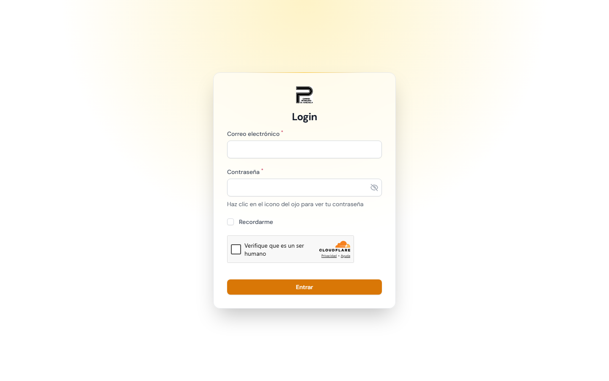
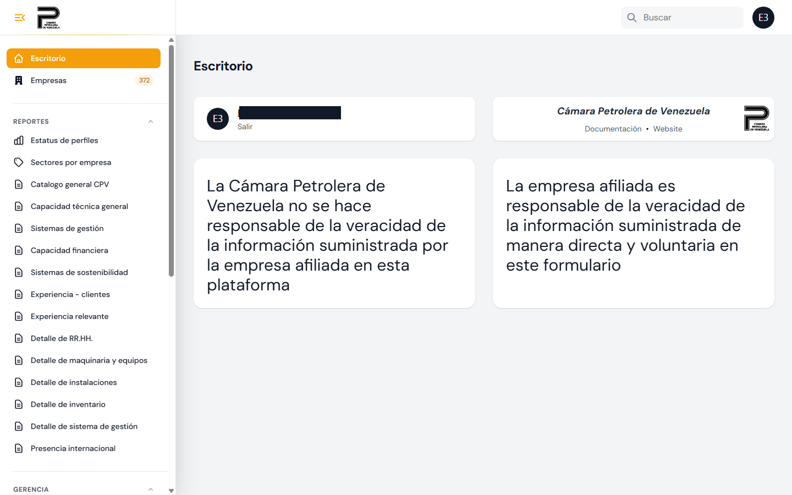
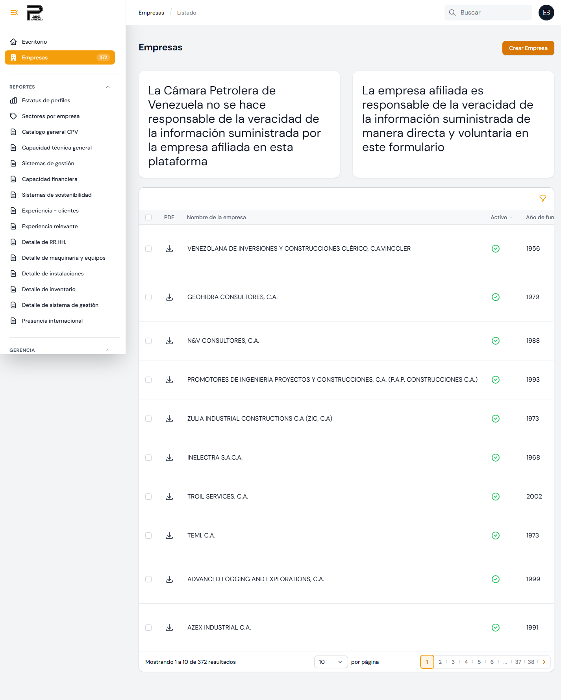
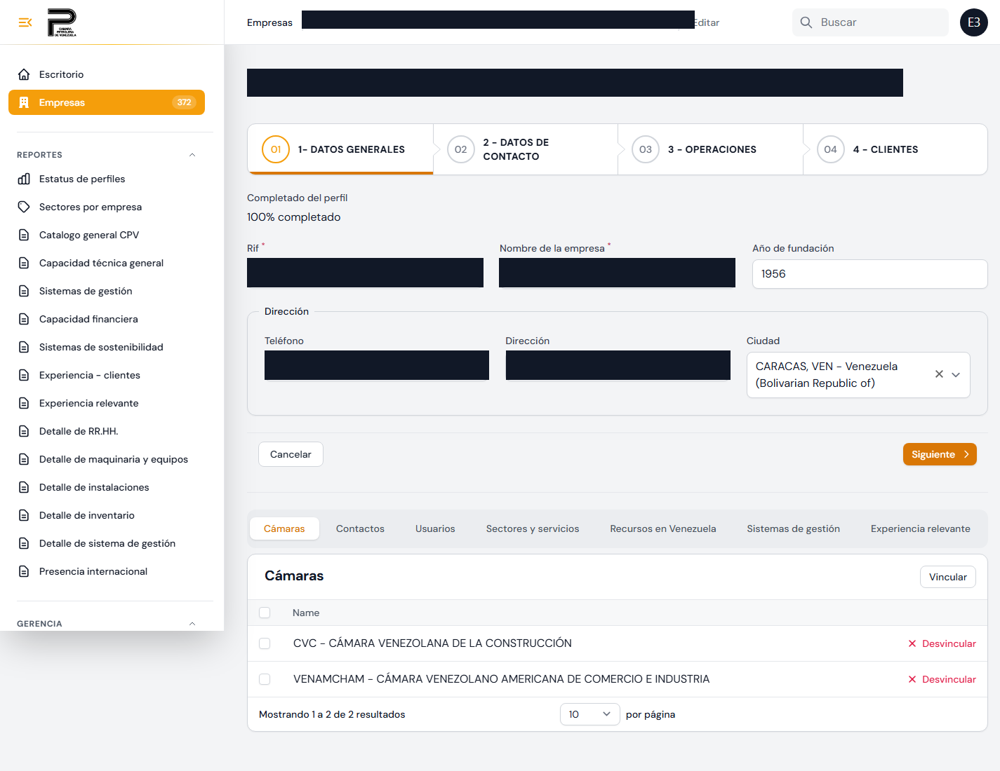
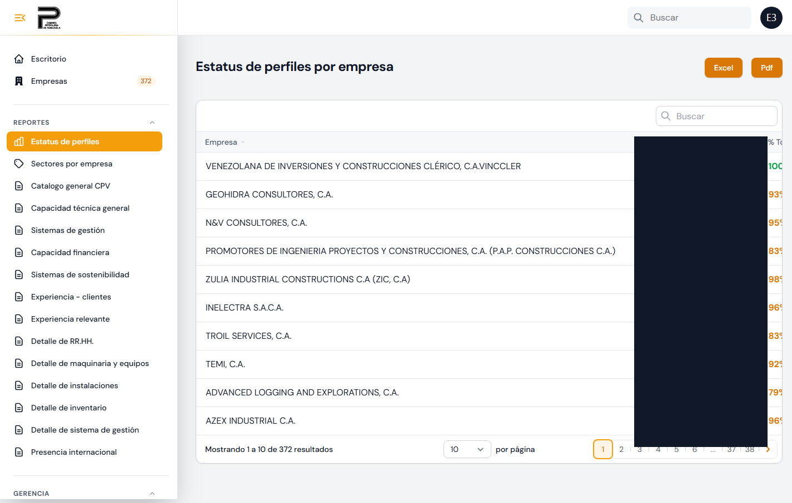
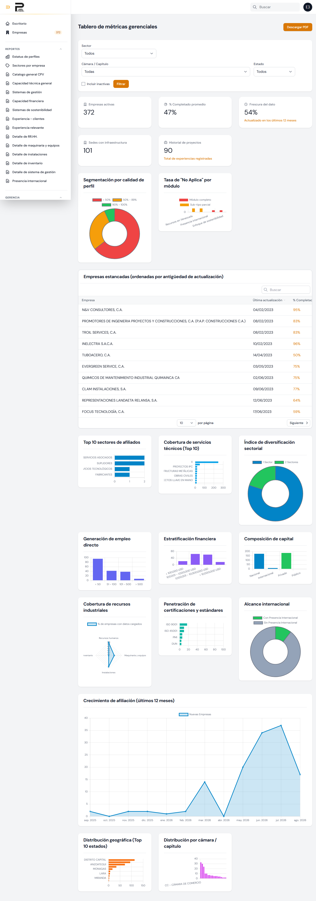
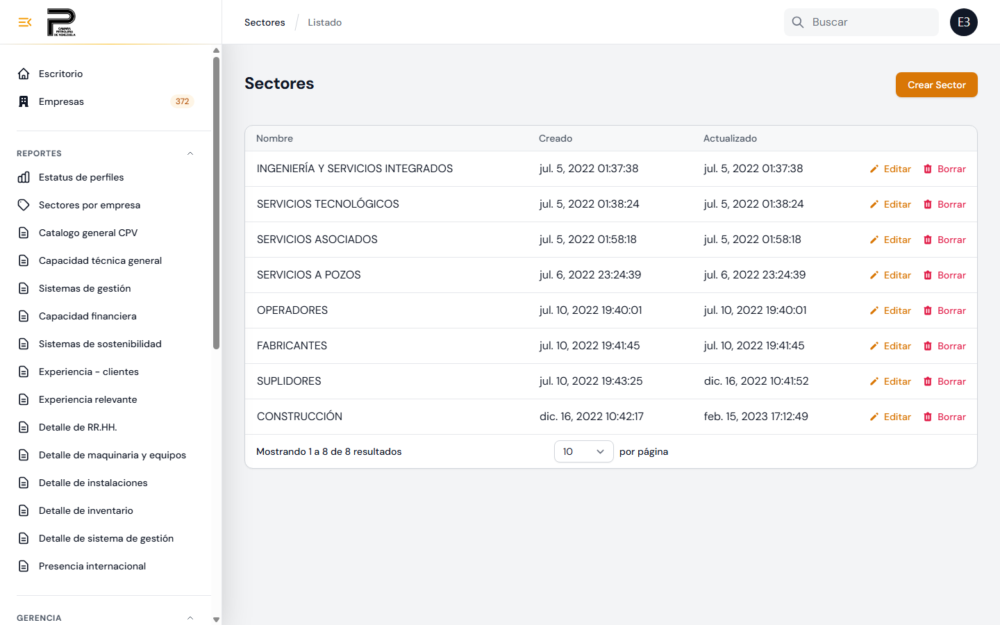
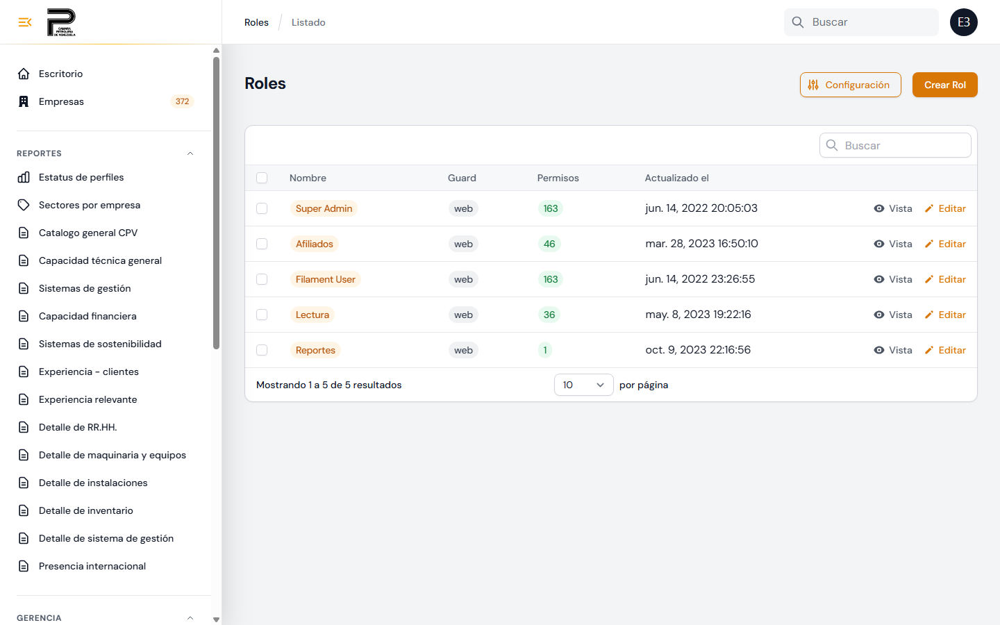

# Perfil de Afiliados — Manual del Administrador

**Guía de administración para el personal de la Cámara**
Cámara Petrolera de Venezuela
Versión 1 — 17 de agosto de 2026

**Sitio:** https://camarapetrolera.app

> Este manual describe las funciones de **administración** (rol Cámara). El manual del afiliado
> —lo que carga cada empresa— está en `docs/manual_usuario/manual_usuario.md`. Aquí se documenta
> cada acción y opción que el administrador puede gestionar, incluidas las que **no** son visibles
> para los afiliados.
>
> **Capturas:** este manual incluye capturas reales del panel de administración. Para **actualizarlas**
> más adelante, use el script `capturar_admin.mjs` (ver **Anexo A**). Recuerde que muestran datos
> reales de las empresas: **tape lo sensible antes de distribuir** el documento.
>
> **Nota de privacidad (24-ago-2026):** se revisaron las 7 capturas de `capturas_admin/` antes de
> commitear este manual. Se taparon con recuadros negros: el RIF/teléfono/dirección/nombre de la
> empresa de ejemplo (sección 3.2), los nombres reales de "Usuario principal" de las 9 empresas
> visibles en el reporte de Estatus de perfiles (sección 5), y el nombre del administrador que
> tenía la sesión iniciada (sección 2, Escritorio). El resto de las capturas solo muestra nombres
> de empresas o datos agregados — se consideró de menor sensibilidad para un manual de uso interno
> de la Cámara, a diferencia del manual del afiliado que se distribuye a los 372 afiliados. Si se
> regeneran las capturas con `capturar_admin.mjs`, hay que repetir esta revisión antes de
> redistribuir el manual.

---

## Índice

1. Roles y qué ve cada uno
2. Ingreso al panel
3. Gestión de Empresas (crear, editar, activar, eliminar)
4. Asignar afiliados y datos que precarga la Cámara (RIF, Nombre, Sector Principal)
5. Estatus de perfiles — el reporte de completitud
6. Tablero de métricas gerenciales
7. Reportes por módulo
8. Catálogos maestros (Mantenimiento)
9. Roles y permisos
10. Preguntas frecuentes del administrador (incluye RIF y % de completitud)

---

## 1. Roles y qué ve cada uno

El sistema tiene tres tipos de acceso (gestionados con Filament Shield):

| Rol | Quién es | Qué puede hacer |
|---|---|---|
| **super_admin** | Personal de la Cámara (administrador) | Todo: crear/editar/activar/desactivar/eliminar empresas, definir el Sector Principal, ver todos los reportes y el tablero gerencial, administrar catálogos y roles. |
| **affiliates** | La empresa afiliada | Solo carga y consulta **su propia** empresa; ve **su propio** porcentaje de perfil. No ve reportes agregados ni el tablero gerencial. |
| **filament_user** | Acceso básico al panel | Acceso mínimo; se usa como base antes de asignar un rol definitivo. |

> **Clave:** las funciones de reportes agregados y gerencia están protegidas por permiso. Un afiliado
> **no** las ve aunque conozca la URL.

---

## 2. Ingreso al panel

**Ingreso:** https://camarapetrolera.app/admin/login

1. Escriba su correo y contraseña de administrador.
2. El menú lateral muestra los grupos según sus permisos: **Empresas**, **Reportes**, **Gerencia**,
   **Mantenimiento** y **Roles**.

Una vez dentro verá el **Escritorio**, con el menú por grupos a la izquierda:

---

## 3. Gestión de Empresas

Es el módulo central. Menú **Empresas**.

### 3.1 Listado de Empresas

Columnas: descarga **PDF** del perfil, Nombre, **Activo** (indicador), Año de fundación, Ciudad,
País, Sector principal, Servicios y **% Perfil** (porcentaje de completitud de esa empresa).

**Filtros disponibles:** Activo (sí/no), País, Ciudad y Sector.

> El listado muestra las empresas **asociadas a su usuario**. Si necesita ver el estado de *todas*
> las empresas, use el reporte **Estatus de perfiles** (sección 5) o el **Tablero gerencial**
> (sección 6). Si una empresa no aparece en su listado, verifique que su usuario esté vinculado a
> ella (pestaña Usuarios, sección 4.3).

### 3.2 Crear o editar una empresa

Al crear/editar se completan estos campos:

- **RIF** (obligatorio y único).
- **Nombre de la Empresa** (obligatorio).
- **Año de Fundación**, **Teléfono**, **Ciudad**.
- **Sitio web** y redes sociales (LinkedIn, Twitter/X, Instagram, Facebook, YouTube, Otros).
- **Sector Principal** (obligatorio) y **Sector Secundario** (opcional, debe ser distinto del
  principal). *Ver 4.2.*
- **Facturación anual:** `< 100.000 USD` · `100.001 – 1.000.000` · `1.000.001 – 10.000.000` ·
  `> 10.000.001`.
- **Empleados:** `< 50` · `51 – 100` · `101 – 500` · `> 500`.
- **Estatus actual:** Activa / Inactiva.
- **Propiedad:** Privado / Público.
- **Origen del capital:** Nacional / Internacional.
- **Clientes** (nombre y país), se agregan tantas líneas como haga falta.

### 3.3 Acciones sobre empresas (selección múltiple)

En el listado, seleccione una o varias empresas para habilitar:

| Acción | Quién puede | Qué hace |
|---|---|---|
| **Editar** | Todos | Abre la empresa seleccionada (solo con 1 marcada). |
| **Activar** | Solo super_admin | Marca las empresas como Activas. |
| **Desactivar** | Solo super_admin | Marca las empresas como Inactivas. |
| **Eliminar** | Solo super_admin | Borra las empresas **y todos sus datos asociados**. Pide escribir `BORRAR` para confirmar. **No se puede deshacer.** |
| **Exportar** | Todos | Descarga el listado (Excel/PDF). |

> **Eliminar** borra Recursos, Sistemas de gestión, Experiencias, Presencia, Sostenibilidad y
> Contactos propios de esa empresa. Los catálogos compartidos (Cámaras, Sectores/Servicios,
> usuarios) solo se **desvinculan**, no se borran.

---

## 4. Datos que precarga la Cámara y asignación de afiliados

### 4.1 RIF y Nombre

Al **registrar** una empresa, la Cámara es quien captura el **RIF** y el **Nombre**. En la práctica
la Cámara suele precargar también el resto de los datos generales. El afiliado, al entrar, solo debe
**verificar** que el RIF esté correcto; si algo está mal, lo corrige la Cámara.

### 4.2 Sector Principal (exclusivo de la Cámara)

El **Sector Principal** solo lo puede editar el **super_admin**. Para el afiliado el campo aparece
**bloqueado**, con la nota: *"Este dato lo define la Cámara Petrolera al registrar tu empresa."* El
**Sector Secundario** sí lo puede editar el afiliado. Máximo 2 sectores por empresa.

### 4.3 Vincular usuarios (afiliados) a una empresa

Dentro de la empresa, pestaña **Usuarios**: use **Vincular** para asociar la cuenta del afiliado a
su empresa. Hasta que esté vinculado, el afiliado no verá ninguna empresa en su escritorio.

### 4.4 Otras pestañas de la empresa

Cámaras · Contactos · Servicios · Recursos (Assets) · Gestión · Experiencias · Presencia ·
Sostenibilidad. Son las mismas secciones que carga el afiliado; el administrador puede consultarlas
o completarlas.

---

## 5. Estatus de perfiles — el reporte de completitud

Menú **Reportes → Estatus de perfiles**. **Visible solo para la Cámara** (protegido por permiso).

Es una tabla con **todas** las empresas afiliadas y su avance de carga:

- **Empresa** y **Usuario principal**.
- **% Total** (promedio de los módulos), resaltado por color: verde 100 %, amarillo parcial, rojo 0 %.
- Una columna por módulo: **Datos Grales., Sectores, Contactos, Recursos, Gestión, Presencia,
  Experiencia, Sostenibilidad**.
- Un clic en una fila abre la empresa para editarla.
- Botones **Excel** y **PDF** para exportar el reporte.

### Cómo se calcula el porcentaje

- El perfil se divide en **8 módulos**; el **% Total** es el **promedio** de esos 8.
- Un módulo cuenta como **completo (100 %)** si tiene datos cargados **o** si se marcó **"No Aplica"**.
- **Datos Generales** siempre cuenta como 100 % (por eso el RIF/Nombre precargados no dejan el perfil
  incompleto).
- En **Recursos** y **Gestión**, que tienen varios subtipos, el porcentaje refleja cuántos subtipos
  están completos o marcados "No Aplica".

> **Este reporte es de la Cámara.** El afiliado **no** lo ve. El afiliado solo ve **su propio**
> porcentaje (columna "% Perfil" en su empresa e indicador por pestaña). Ver también la sección 10.

---

## 6. Tablero de métricas gerenciales

Menú **Gerencia → Tablero gerencial**. **Solo Cámara** (protegido por permiso).

Panel de indicadores para la Junta Directiva, con gráficos de: resumen general, calidad de perfiles,
uso de "No Aplica", empresas estancadas, top de sectores, cobertura de servicios, diversificación,
empleo, facturación, composición de capital, recursos, certificaciones, alcance internacional,
crecimiento de afiliación, distribución geográfica y por cámaras.

- **Filtros:** por Sector, Cámara y Estado.
- Botón **Descargar PDF** del tablero.

---

## 7. Reportes por módulo

Menú **Reportes**. Vistas consolidadas por sección (Clientes, Experiencia, Instalaciones, Finanzas,
Inventario, Maquinaria, Gestión, Presencia, Recursos, Sectores, Sostenibilidad, etc.), útiles para
revisar un aspecto en todas las empresas. Se rigen por los mismos permisos: **visibles para la Cámara**.

---

## 8. Catálogos maestros (Mantenimiento)

Menú **Mantenimiento**. Son las listas que alimentan los formularios del afiliado; manténgalas al
día para que los afiliados elijan opciones correctas.

- **Sectores** y **Servicios** (los servicios se agrupan por sector).
- **Cámaras** (capítulos/cámaras a las que puede pertenecer una empresa).
- **Ubicaciones** (países y ciudades).
- **Áreas**.
- **Infraestructura:** Sectores, Tipos, Sistemas, Región o Distrito e Instalaciones (usados en
  Experiencia Relevante).
- **Clientes** (catálogo de referencia).

Cada catálogo permite **crear, editar y eliminar** registros. Evite eliminar un elemento que ya esté
en uso por alguna empresa.

---

## 9. Roles y permisos

Menú **Roles** (Filament Shield). Permite:

- Crear roles y asignarles permisos por recurso y por página (por ejemplo, dar acceso a "Estatus de
  perfiles" o al "Tablero gerencial").
- El rol **super_admin** tiene todos los permisos.
- Asigne a cada usuario el rol que corresponda (`affiliates` para empresas, `super_admin` para la
  Cámara).

> Recomendación: otorgue **super_admin** solo al personal de confianza de la Cámara; los reportes
> agregados y la eliminación de empresas dependen de ese rol.

---

## 10. Preguntas frecuentes del administrador

**¿El afiliado ve el "reporte de completitud"?**
No. El afiliado solo ve **su propio** porcentaje de perfil (el de su empresa). El **reporte con
todas las empresas** ("Estatus de perfiles", sección 5) y el **Tablero gerencial** (sección 6) son
exclusivos de la Cámara y están protegidos por permiso. Si desea que el afiliado **tampoco** vea su
propio porcentaje, eso requiere un ajuste en el sistema (ocultar ese indicador), no un cambio de
manual — coordínelo con el equipo de desarrollo.

**¿Quién carga el RIF y el Nombre de la empresa?**
Los precarga la **Cámara** al registrar la empresa. El campo RIF es obligatorio y único. El afiliado
solo debe **verificarlo**; si está mal, lo corrige la Cámara. El **Sector Principal** también lo
define la Cámara y aparece bloqueado para el afiliado.

**Un afiliado no ve su empresa. ¿Por qué?**
Su usuario no está vinculado a la empresa. Vincúlelo desde la empresa → pestaña **Usuarios**
(sección 4.3).

**¿Por qué una empresa aparece con menos de 100 % aunque cargó datos?**
Alguna de las 8 secciones está vacía y sin marcar "No Aplica". Marcar "No Aplica" en lo que no
corresponde lleva el perfil al 100 %.

**¿Se puede recuperar una empresa eliminada?**
No. "Eliminar" borra la empresa y sus datos propios de forma permanente (pide escribir `BORRAR`).
Prefiera **Desactivar** si solo desea ocultarla temporalmente.

---

## Anexo A — Cómo generar las capturas del panel de administrador

El login del panel usa **contraseña + Cloudflare Turnstile (anti-bot)**, y esa verificación **falla
en el navegador de Playwright** (lo detecta como automatizado). Por eso el script se conecta a **su
Chrome real** —donde usted inicia sesión normalmente y el Turnstile sí pasa— y solo automatiza las
capturas sobre esa sesión (modo CDP: depuración remota).

**Pasos:**

1. **Abra su Chrome real con depuración remota.** En PowerShell (una sola línea):
   `& "C:\Program Files\Google\Chrome\Application\chrome.exe" --remote-debugging-port=9222 --user-data-dir="$env:TEMP\cpv-chrome" "https://camarapetrolera.app/admin/login"`
   (Ajuste la ruta de `chrome.exe` si difiere. El `--user-data-dir` es un perfil aparte y limpio.)
2. En esa ventana de Chrome, **inicie sesión** con su cuenta de administrador (correo, contraseña y
   Turnstile — como es Chrome real, la verificación pasa).
3. En una terminal, si Playwright no está en el proyecto: `npm i -D playwright` (los navegadores ya
   están instalados).
4. Ejecute: `node docs/manual_usuario/capturar_admin.mjs`
5. El script captura automáticamente el escritorio, Empresas, Estatus de perfiles, Tablero gerencial
   y Roles. Luego, en **modo manual**, navegue a cualquier otra pantalla (editar una empresa, un
   catálogo) y escriba un nombre para capturarla; escriba `fin` para terminar.
6. Las imágenes quedan en `docs/manual_usuario/capturas_admin/`.

**Capturas sugeridas y dónde van en este manual:**

| Archivo | Sección |
|---|---|
| `21-empresas-listado.png` | 3.1 Listado de Empresas |
| `22-empresa-editar-datos-generales.png` | 3.2 Crear o editar una empresa |
| `23-empresa-usuarios.png` | 4.3 Vincular usuarios |
| `24-estatus-perfiles.png` | 5. Estatus de perfiles |
| `25-tablero-gerencial.png` | 6. Tablero gerencial |
| `26-roles.png` | 9. Roles y permisos |
| `27-mantenimiento-sectores.png` | 8. Catálogos maestros |

> **Privacidad:** estas pantallas muestran datos reales de **todas** las empresas afiliadas. Tape los
> datos sensibles antes de publicar el manual, igual que se hizo con las capturas del afiliado (ver la
> nota de privacidad del manual del afiliado).

Cuando tenga las capturas, avíseme y regenero el Word insertándolas en cada sección.

---

Cámara Petrolera de Venezuela — Perfil de Afiliados · Manual del Administrador
