# Perfil de Afiliados — Manual de Usuario

**Guía rápida para cargar correctamente su información**
Cámara Petrolera de Venezuela
Versión 3.2 — 24 de agosto de 2026

**Sitio:** https://camarapetrolera.app

> Reemplaza a la v2 (`docs/Manual_Usuario_Perfil_Afiliados_v2.docx`). Los recuadros
> `[ CAPTURA PENDIENTE ]` se reemplazaron por capturas reales tomadas con Playwright contra producción
> (cuenta de afiliado real, con nombre/RIF/teléfono/dirección/contactos de la empresa tapados antes de
> publicar — ver nota de privacidad al final de este documento).
>
> **Ajustes v3.1 (según comentarios del afiliado, 14-ago-2026):** se retiraron las URLs internas que
> aparecían al inicio de cada sección; se aclaró que el RIF y el nombre de la empresa los precarga la
> Cámara; y se precisó que los reportes de completitud agregados son de uso exclusivo de la Cámara.
>
> **Ajustes v3.2 (revisión de manual con la Cámara, 21-ago-2026):** se quitó la opción "Vincular"
> de Contactos (ahora cada empresa carga los suyos, ver sección 3); se aclaró que un
> sector/servicio/cámara que no aparece al buscarlo es porque ya está vinculado; y se agregó una
> fila en "Errores comunes" (sección 7) para ese caso. **Estos cambios de sistema todavía no están
> desplegados a producción al momento de escribir esto** — las capturas de "Empresas" (listado) y
> "Contactos" pueden no coincidir exactamente hasta el próximo deploy; quedó anotado junto a cada
> una.

---

## Qué cambió recientemente

Si ya conoce el sistema, esto es lo nuevo desde la última vez que cargó datos. Cada punto se
explica en detalle en su sección correspondiente.

| Cambio | Qué significa para usted |
|---|---|
| Sector Principal y Secundario | Su empresa tiene un Sector Principal (lo define la Cámara) y puede agregar un Sector Secundario. Máximo 2 sectores en total. |
| Opción "No Aplica" | Si una sección no corresponde a su empresa, actívela como "No Aplica" en vez de dejarla vacía. |
| Porcentaje de completitud | El sistema le muestra qué tan completo está su perfil, por sección y en total. |
| Formato de Teléfono y RIF | Se validan y formatean automáticamente al escribir (`+58-XXX-XXXXXXX` y letra+9 dígitos). |

---

## 1. Cómo ingresar al sistema

### Si ya tiene una cuenta

1. Ingrese a www.camarapetrolera.app.
2. Escriba su correo electrónico y contraseña.
3. Presione "Entrar".

### Si es su primera vez

1. Haga clic en "creación de cuenta".
2. Complete Nombre, Correo electrónico, Contraseña y Confirmar la contraseña.
3. Presione "Registrarse".
4. Revise su correo (y la carpeta de spam) para activar la cuenta.

> **CONSEJO:** Después de crear la cuenta, avise a la Cámara para que le asignen el perfil y la
> empresa correspondiente — hasta entonces, su escritorio aparecerá sin empresas asociadas.

**Capturas:**
- 
- 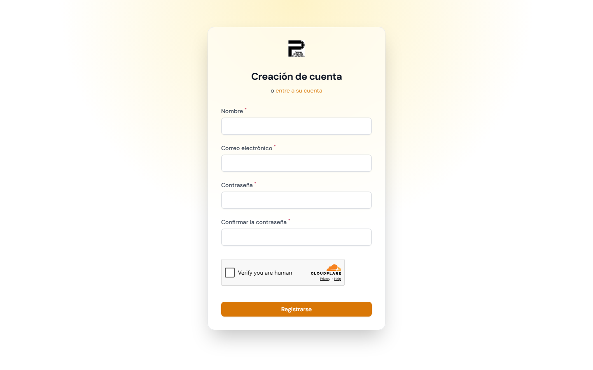

---

## 2. Datos generales de la empresa

### Descargar el perfil completo en PDF

En el listado de "Empresas", la primera columna de cada fila muestra un ícono de descarga (⬇,
etiquetado "PDF"). Al hacer clic se abre en una pestaña nueva un reporte en PDF con todo el perfil
cargado de esa empresa: datos generales, sectores y servicios, contactos, cámaras, recursos en
Venezuela, sistemas de gestión, presencia internacional, experiencia relevante y sostenibilidad.

> **CONSEJO:** Es la forma más rápida de revisar o compartir de un vistazo todo lo que su empresa
> tiene cargado en el sistema, sin tener que entrar pestaña por pestaña.

Vaya a "Empresas" y presione "Editar" sobre su empresa.

1. El RIF y el Nombre de la Empresa los precarga la Cámara: verifíquelos y complete Año de Fundación, Teléfono, Dirección y Ciudad.
2. Presione "Siguiente" para pasar a Datos de Contacto (redes sociales).
3. Complete Operaciones: Facturación anual, Empleados, Estatus, Propiedad y Origen del capital.
4. Agregue sus principales Clientes de los últimos 15 años (nombre y país). Use "Añadir cliente"
   para sumar más líneas.
5. Presione "Guardar". El mensaje "Guardado" confirma que quedó registrado.

> **IMPORTANTE:** El RIF y el Nombre de la Empresa los precarga la Cámara. Verifique que el RIF esté
> escrito correctamente (letra V, E, J, P o G seguida de 9 dígitos, sin guiones ni espacios); si algo
> no está correcto, contacte a la Cámara. El Teléfono se formatea solo como `+58-XXX-XXXXXXX` a medida
> que escribe.

> **⚠️ Problema conocido (detectado 2026-08-12):** en varias empresas probadas, el botón
> "Siguiente" del paso 3 (Operaciones) al paso 4 (Clientes) no avanza — el campo "Sector Principal"
> marca error de campo requerido aunque se vea con un sector cargado. Reportado al equipo de
> desarrollo para su corrección; si le pasa lo mismo, contacte a la Cámara.

**Capturas:**
- 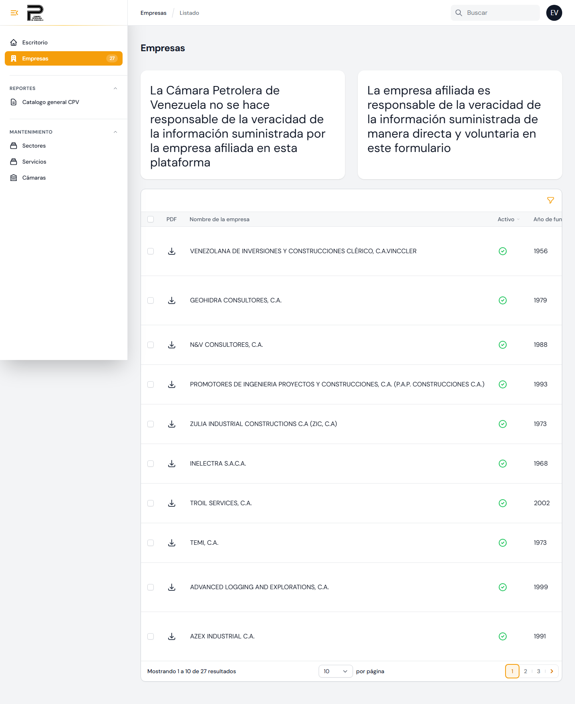 — la primera columna (ícono ⬇) es el
  acceso al PDF del perfil completo, descrito arriba. *Captura pendiente de actualizar tras el
  próximo deploy: el ícono de filtro (arriba a la derecha de la lista) va a dejar de
  aparecer para la mayoría de los usuarios — queda reservado para administradores de la Cámara,
  ya que casi todos administran una sola empresa y el filtro no les aporta nada.*
- 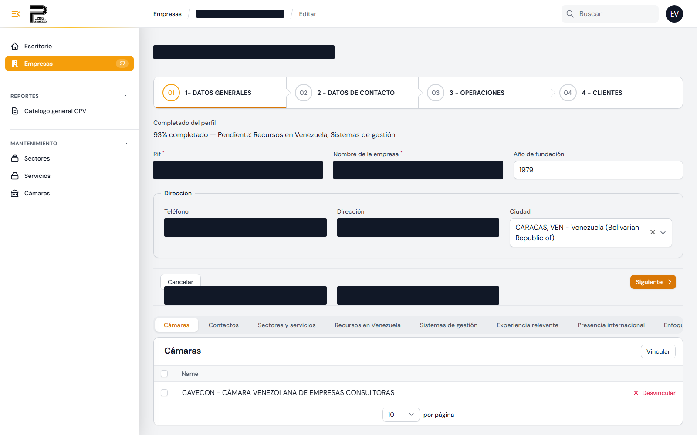
- 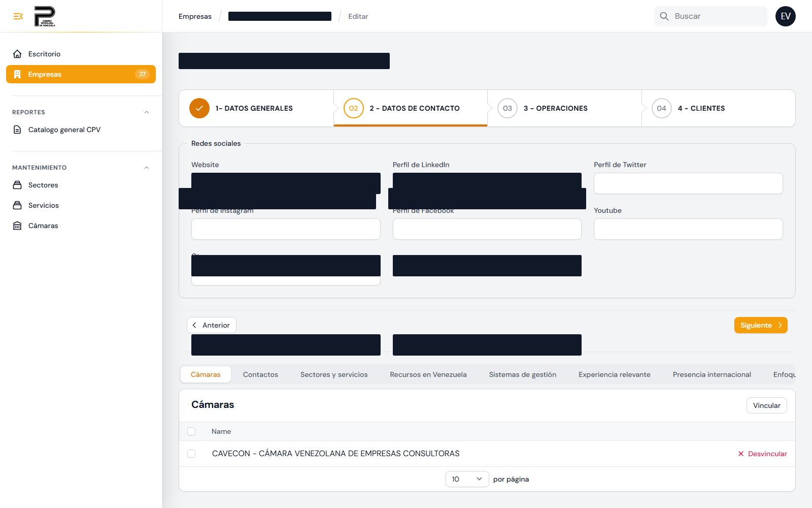
- 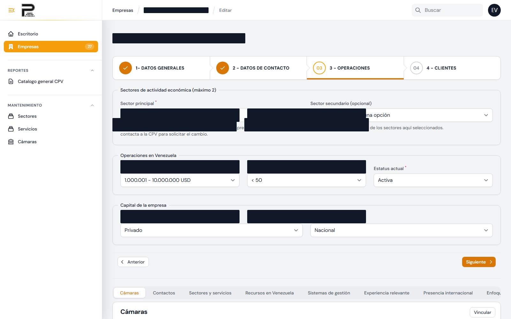
- [ CAPTURA PENDIENTE — paso 4 "Clientes" del wizard, bloqueado por el problema conocido de arriba ]

---

## 3. Sectores, Servicios, Contactos y Cámaras

Debajo de los Datos Generales encontrará estas pestañas adicionales.

### Sectores y Servicios

1. Presione "Vincular".
2. Seleccione un Sector y luego los Servicios asociados a ese sector.
3. Repita si necesita agregar otro sector.

> **IMPORTANTE:** Máximo 2 sectores por empresa. El Sector Principal lo asigna la Cámara al
> registrar la empresa y aparece bloqueado para edición — si no está de acuerdo, contacte a la
> Cámara para solicitar el cambio. El Sector Secundario sí lo puede editar usted.

> **CONSEJO:** Si un servicio no aparece en la lista al buscarlo, es porque su empresa ya lo
> tiene vinculado — no hace falta cargarlo de nuevo, y no se puede vincular el mismo servicio dos
> veces.

### Contactos

Presione "Nuevo Contacto" y complete Nombre, Posición, Teléfono y Email.

> **CONSEJO:** Cada empresa carga sus propios contactos. Ya no existe la opción de "Vincular" un
> contacto ya cargado por otra empresa — se retiró para que los datos de contacto de cada
> afiliado (nombre, teléfono, email) solo los vea esa empresa, no el resto de los afiliados.

### Cámaras

Presione "Vincular" y seleccione todas las cámaras en las que su empresa participe.

> **CONSEJO:** Si una cámara no aparece en la lista al buscarla, es porque su empresa ya está
> vinculada a ella.

**Capturas:**
- 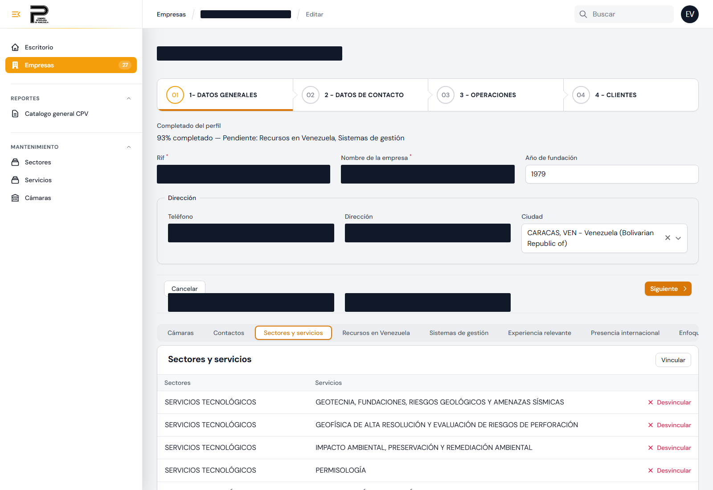
- 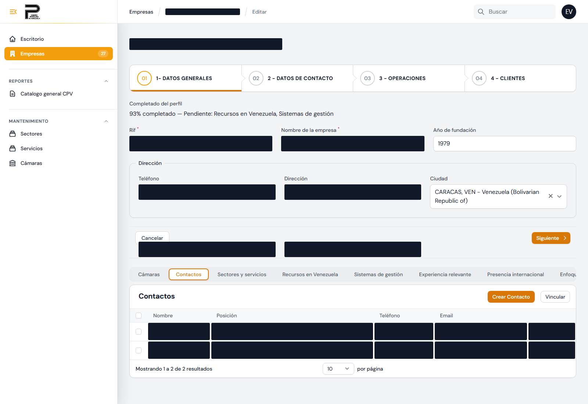 — *captura pendiente de actualizar tras el
  próximo deploy: todavía muestra el botón "Vincular" junto a "Crear Contacto", que ya se quitó
  del sistema (ver el consejo arriba).*
- 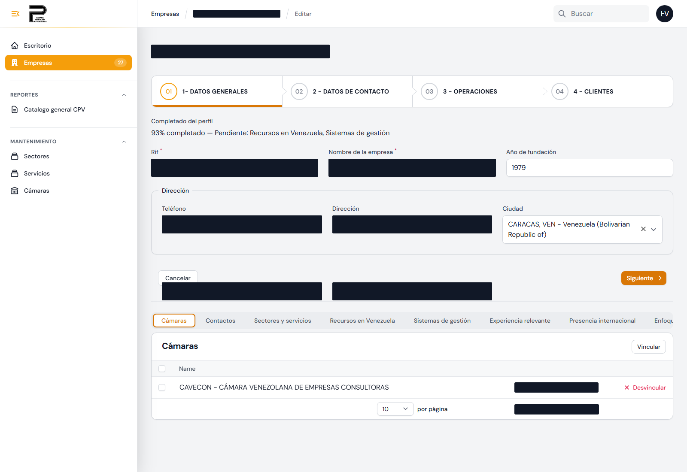

---

## 4. Recursos, Sistemas de Gestión, Presencia y Experiencia

Estas 4 secciones comparten el mismo criterio: si una parte no corresponde a su empresa, actívela
como "No Aplica" en vez de dejarla vacía sin explicación.

> **IMPORTANTE:** Una sección vacía y sin marcar "No Aplica" resta puntos a su porcentaje de
> completitud, y puede interpretarse como un dato que falta cargar en vez de algo que realmente no
> aplica a su empresa.

### Recursos en Venezuela

Complete lo que corresponda en cada uno de los 4 tipos (o márquelos "No Aplica" individualmente):

- Recursos Humanos — por tipo (Bachilleres, Técnicos, Ingenieros, Administrativos, Gerencial,
  Directivo) y nivel (Junior, Medium, Senior).
- Maquinaria y Equipos — cantidad y valor estimado, por categoría.
- Instalaciones — cantidad, superficie en m² y tipo de propiedad.
- Inventario — Materia Prima y Productos Terminados, cantidad, unidad y valor estimado.

> **CONSEJO:** Los valores de maquinaria e inventario se cargan en orden de magnitud (rangos), no
> como cifras exactas.

### Sistemas de Gestión

Marque las certificaciones que tenga en cada uno de los 6 grupos (Calidad, Ambiente, Seguridad,
Credibilidad y Transparencia, Gestión de Proyectos, Seguridad de la Información), o use "Otros"
para certificaciones que no estén en la lista.

### Presencia Internacional

1. Indique si tiene oficinas fuera de Venezuela y complete país, superficie, empleados y si está
   activa.
2. Indique si tiene experiencia en proyectos fuera de Venezuela (últimos 20 años): país, cantidad
   de proyectos, rol, monto ejecutado, empleados y principales clientes.

> **CONSEJO:** La experiencia en proyectos internacionales cuenta aunque su empresa no tenga
> oficina en ese país.

### Experiencia Relevante

Cargue proyectos relevantes de los últimos 10 años: año, infraestructura (sector, tipo, sistema,
región, instalación), orden de magnitud del contrato, horas-hombre, tipo de trabajo (sector y
servicio) y una breve descripción.

**Capturas:**
- 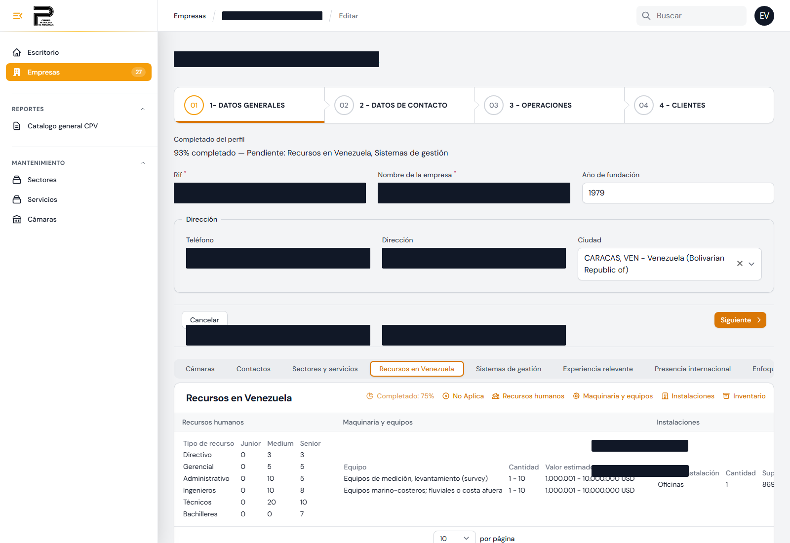
- 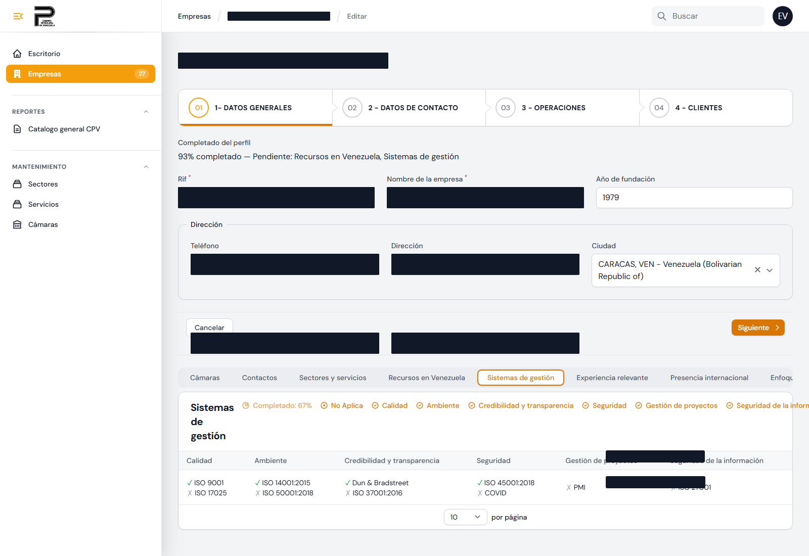
- 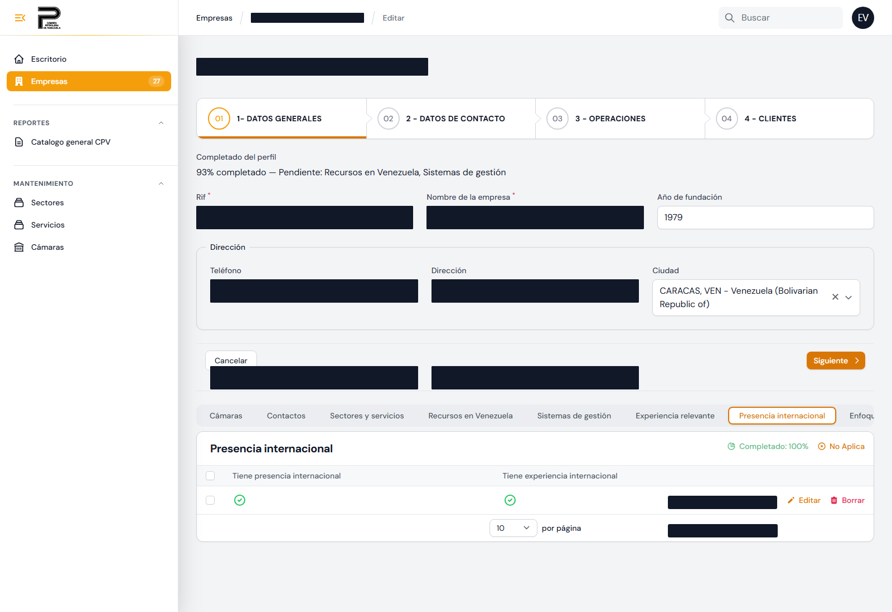
- 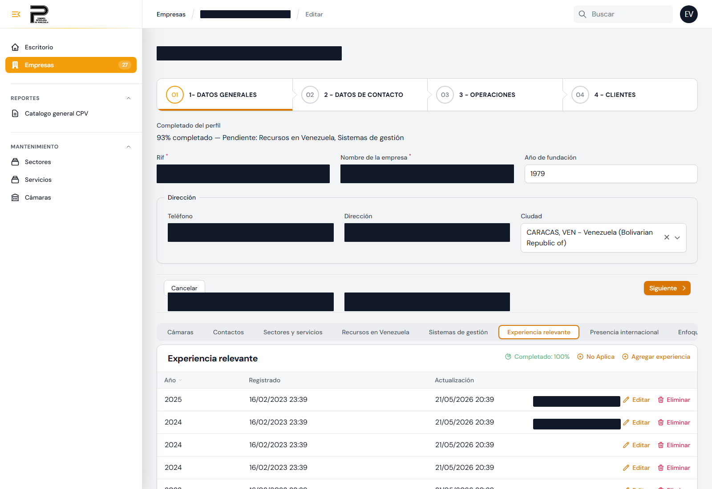
- 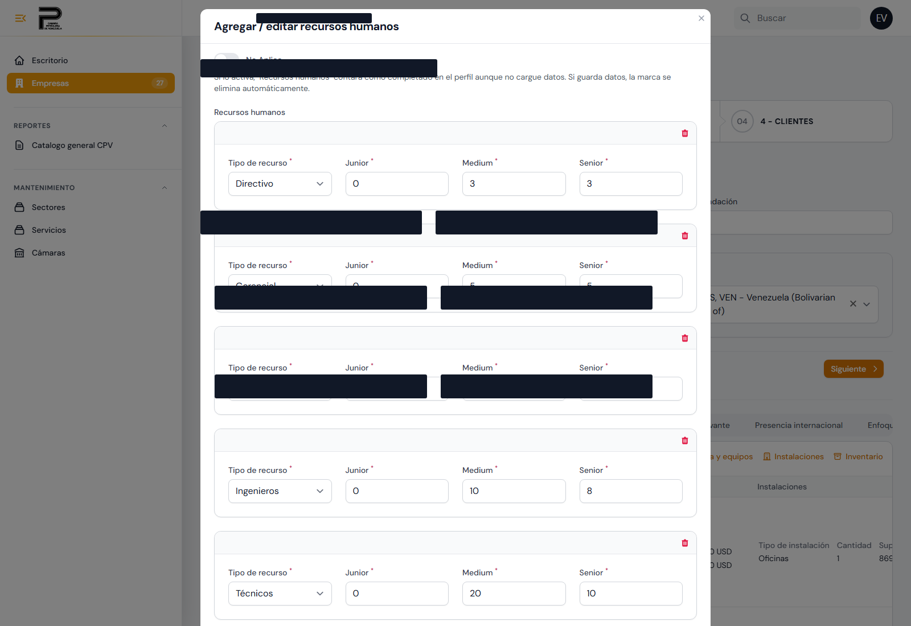

---

## 5. Enfoques de Sostenibilidad

Indique el estatus de cada enfoque: Sí - Activo, Sí - Inactivo, o No.

| Enfoque | En qué consiste |
|---|---|
| 1. Eficiencia material y energética | Hacer más con menos recursos, generando menos residuos y contaminación. |
| 2. Valor a partir de los desechos | Estrategia para reducir o reutilizar desechos en vez de solo desecharlos. |
| 3. Energías renovables y procesos naturales | Reduce la dependencia de insumos finitos o difíciles de obtener. |
| 4. Funcionalidad en vez de Propiedad | El cliente usa el servicio sin ser dueño del producto físico. |
| 5. Participación con stakeholders | Cuidado a largo plazo de un recurso o comunidad, con reconocimiento externo. |
| 6. Fomento de la suficiencia | Reduce activamente el consumo y la producción, y lo promueve en sus clientes. |
| 7. Reorientación del objeto social | Prioriza el valor social o ambiental sobre el beneficio económico. |
| 8. Soluciones a escala | Busca escalar soluciones locales efectivas para mayor impacto. |

**Capturas:**
- 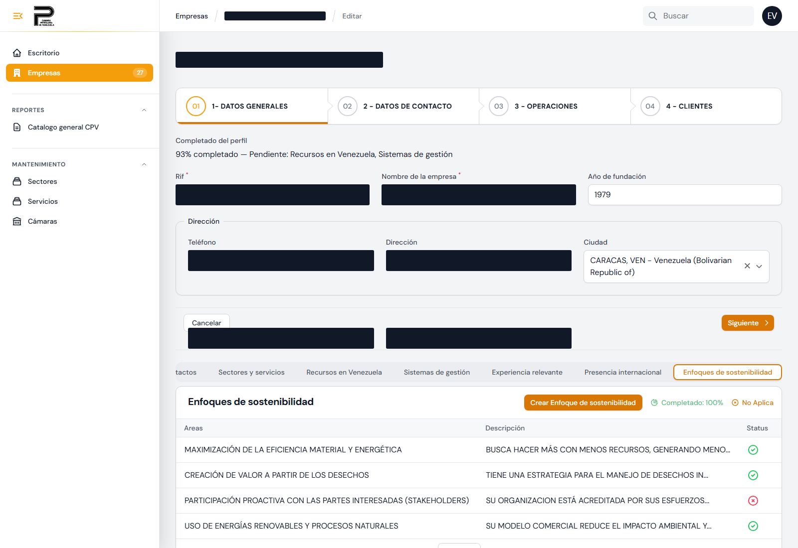

---

## 6. Su porcentaje de completitud

El sistema calcula qué tan completo está su perfil, en total y por sección, visible en el listado
de Empresas y en cada pestaña.

- Una sección cuenta como completa si tiene datos cargados, o si está marcada "No Aplica".
- En Recursos y Sistemas de Gestión, que tienen varios tipos dentro, el porcentaje refleja cuántos
  de esos tipos están completos o marcados "No Aplica".

> **CONSEJO:** Llegar al 100% (con datos reales o "No Aplica" donde corresponda) es lo que
> asegura que su empresa aparezca bien representada en los reportes y búsquedas de la Cámara.

**Capturas:**
- 

---

## 7. Errores comunes al cargar datos

| Situación | Qué hacer |
|---|---|
| El teléfono se ve raro al escribir | Es normal — el formato `+58-XXX-XXXXXXX` se aplica solo, siga escribiendo los dígitos. |
| No puede agregar un tercer sector | El límite es 2 sectores por empresa (Principal + Secundario). |
| El Sector Principal aparece bloqueado | Es intencional — solo lo edita la Cámara. Contáctelos para solicitar un cambio. |
| Una sección quedó vacía | Si no corresponde a su empresa, actívela como "No Aplica" en vez de dejarla en blanco. |
| No está seguro si guardó los cambios | Cada pestaña tiene su propio "Guardar" o "Siguiente"; el mensaje "Guardado" en la parte superior confirma el registro. |
| No encuentra un sector, servicio o cámara al buscarlo para vincular | Es porque su empresa ya está vinculada a ese elemento — no vuelve a aparecer en la lista para evitar duplicados. |

---

## 8. Para su información: funciones exclusivas de la Cámara

Estas funciones **no son visibles para los afiliados**: solo las usa la Cámara. Se listan aquí
únicamente para explicar algunos comportamientos que usted puede notar en el sistema.

- Reportes de completitud y de sectores del total de empresas afiliadas (vista agregada de la Cámara).
  No los confunda con su propio porcentaje de completitud (sección 6), que sí es suyo y solo refleja
  su empresa.
- Tablero de Métricas Gerenciales para la Junta Directiva.
- Activar, desactivar o eliminar empresas, y aprobar cambios al Sector Principal.

---

## Nota de privacidad de las capturas de este documento

Las capturas se tomaron sobre una empresa afiliada real (no una cuenta de prueba dedicada), porque
el sistema no tenía una disponible al momento de armar este manual. Antes de publicar se taparon
manualmente: nombre de la empresa, RIF, teléfono, dirección, sitio web/redes sociales, y los
nombres/cargos/teléfonos/emails de sus contactos — cualquier caja negra en las capturas corresponde
a un dato real oculto, no a un campo vacío del sistema. Si en el futuro se crea una empresa de
prueba dedicada, conviene re-tomar estas capturas contra esa cuenta para no depender de tapar datos
de un afiliado real.

---

Cámara Petrolera de Venezuela — Perfil de Afiliados
